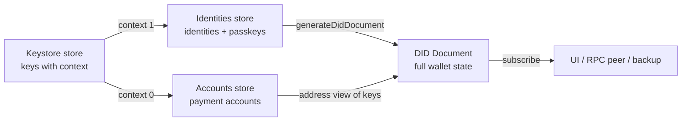

# A Deep Dive into State Flows

> How data moves through the Wallet Provider Extensions, and why that shape lets
> us do something powerful: describe the **entire** state of a wallet — every
> identity, every account, every passkey — as a single, standard document that
> is always up to date, without any component telling any other component to
> update.

## Who this is for

This guide is for every engineer working on (or building on top of) the Wallet
Provider Extensions, whether or not you have ever written a line of "functional"
or "immutable" code before. You do **not** need a React background. React is one
consumer of these ideas, but the ideas themselves are plain TypeScript and work
the same in a Node CLI, a background service, or a mobile app.

By the end you should be able to answer three questions confidently:

1. **What** is the wallet's superpower, and why is it the state we most want to
   show?
2. **How** do we always know the full state of the wallet — which keys are
   identities, which are spendable accounts, which are passkeys?
3. **Why** does modeling state as flows make that full-state view correct by
   construction, and how you extend it with a new extension of your own.

---

## 1. The superpower: your whole wallet as one document

Most wallet tutorials start with "here is a balance and a send button." We are
going to start somewhere more interesting, because it is where this system
earns its keep.

A wallet is really a small pile of **keys**. Some of those keys are the user's
**identity** (who they are, what they can prove, what they can log into). Some
are **payment accounts** (an address that can hold and move value). Some are
**passkeys** (WebAuthn credentials bound to a site). Historically each of those
lived in its own silo with its own format, and nothing could describe the
_whole_ picture at once.

Because this system keeps all of that state in coordinated stores, we can do
something most wallets cannot: at any instant, we can project the complete state
of the wallet into a single **W3C DID Document** — the open standard for
describing an identity and the keys/services attached to it.

That document is the superpower. It answers, in one standard artifact:

- _Who is this?_ — the identity's `did:key`.
- _What keys prove it?_ — every verification method (Ed25519 identity/account
  keys, P-256 passkeys).
- _What can it connect to?_ — services (e.g. WebRTC ICE servers).

And crucially, because it is _derived from the stores_ rather than hand-written,
it is never stale. Add a passkey, derive a new account — the document that
represents the wallet updates itself. It is a backup format, a sync format, and
a portable description of the wallet's capabilities, all at once.

The rest of this guide explains how the state flows underneath make that
possible, cheap, and safe.

---

## 2. The problem the flow model solves

Picture the moving parts:

- A **keystore** that owns key material and metadata (seeds, HD roots, derived
  signing keys). It changes when the user creates a wallet, imports a recovery
  phrase, derives an account, registers a passkey, or restores from disk.
- An **accounts** layer that shows spendable accounts.
- An **identities** layer that shows who the user is.
- A **consumer** — a UI, a CLI, an RPC peer, or the DID-document projection —
  that must reflect all of this _accurately and instantly_, and never show a
  stale or half-updated picture.

The naive way to wire this is direct calls: when a key is added, the keystore
reaches over and calls `accounts.add(...)`, which calls `identities.add(...)`,
which calls `ui.refresh()`. That rots fast:

- **Everything knows about everything.** Every producer of a change must be
  taught about every new consumer. Adding the DID-document projection would mean
  editing the keystore.
- **Order-of-operations bugs.** A consumer that reads halfway through an update
  sees a "torn" state — a key added but its account/identity not yet built.
- **No single truth.** Keys, accounts, identities, and a cached UI copy drift
  apart. Debugging becomes "which of these four lists is lying to me?"
- **You could never build the document.** A coherent full-state projection is
  impossible if the pieces are scattered and updated by side effects.

The state-flow architecture makes those problems structurally impossible with
three rules:

1. **Each domain has exactly one source of truth** — a _store_.
2. **State is only ever replaced, never edited in place** — it is _immutable_.
3. **Consumers subscribe; producers never call consumers directly** — updates
   _flow_ outward.

Follow those three and the full-state DID document falls out for free.

---

## 3. The three rules, concretely

### Rule 1 — One store per domain

A **store** holds one well-defined slice of state and lets you read it, replace
it, and subscribe to changes. We use [`@tanstack/store`](https://tanstack.com/store).
If two parts of the app disagree, the store is right and they are wrong — by
construction, because they both read from it.

The keystore's state is deliberately tiny and _UI-safe_ — no private key
material, only metadata and a status flag:

```typescript
// keystore/core/src/types/extension.ts
export interface KeyStoreState {
  keys: Key[]; // metadata only — ids, types, public keys, context
  status: string; // "idle" | "generating" | "signing" | "ready" | ...
}
```

The accounts and identities stores are just as small:

```typescript
// accounts/store/src/types.ts
export interface AccountStoreState<T> {
  accounts: T[];
}

// identities/store/src/types.ts
export interface IdentityStoreState {
  identities: Identity[];
}
```

Each store draws a clean boundary. The accounts package can be developed,
tested, and shipped without ever importing the identities package, and vice
versa. The store _is_ the contract between them.

### Rule 2 — Immutability: replace, don't edit

This is the rule newcomers push back on, so let's be concrete.

**Mutable (in-place) — what we do NOT do:**

```typescript
// ❌ Editing the existing array in place.
store.state.accounts.push(newAccount);
```

**Immutable — what we DO:**

```typescript
// accounts/store/src/store.ts
export function addAccount<T>({ store, account }): T {
  store.setState((state) => ({
    ...state, // copy the old state
    accounts: [account, ...state.accounts], // brand-new array
  }));
  return account;
}
```

No `push`, no `splice`, no `account.balance = ...`. We build a **new** state
object from the old one. Removal is the same — `filter` returns a new array:

```typescript
export function removeAccount<T>({ store, address }): void {
  store.setState((state) => ({
    ...state,
    accounts: state.accounts.filter((a) => a.address !== address),
  }));
}
```

Why it earns its keep:

1. **Cheap change detection.** "Did anything change?" is `oldState !== newState`
   (a reference check), not a deep comparison. This is exactly how a UI decides
   whether to re-render — and how the DID projection knows it must be rebuilt.
   Mutate in place and the reference never changes, so the check says "nothing
   changed" and the view silently goes stale — the single most common bug this
   removes.
2. **No torn reads.** A subscriber always sees a _complete_ snapshot; the swap
   from old to new is atomic, so "key added but account not yet built" never
   exists as a shared value.
3. **Debugging and backups for free.** Old snapshots are never mutated, so you
   can log, diff, and keep them.

> The mental model: **state is a series of photographs, not a whiteboard.** You
> never erase and rewrite; you pin up a new photo each time and everyone looks
> at the latest one.

### Rule 3 — Subscribe, don't call

Operations like `addAccount` are plain functions that take everything they need
as arguments (`{ store, account }`) and reach for no globals — trivial to test.
We wrap them with **hooks**
([`before-after-hook`](https://github.com/gr2m/before-after-hook)) so behavior
can be extended from the outside without editing the operation:

```typescript
// accounts/store/src/extension.ts
account: {
  store: {
    async addAccount(account) {
      return hooks("add", addAccount, { store, account });
    },
    hooks,
  },
}
```

And consumers _subscribe_; producers never call them:

```typescript
accountsStore.subscribe((state) => {
  /* react to new accounts */
});
```

That is the whole trick behind the DID document: it subscribes to the stores and
rebuilds itself. Nobody has to remember to call it.

---

## 4. We always know the full state: identities vs. payment accounts

Here is the key fact that makes the superpower possible: **the wallet already
knows what every key is for.** Keys are derived under a numeric `context`, and
that context tells us the key's role. Two small bridge extensions read the same
keystore and route keys to the right store:

- **Context 0 → a payment account.** The Algorand accounts bridge
  (`accounts/keystore-extension`) turns each address-context key into a spendable
  account:

  ```typescript
  // accounts/keystore-extension/src/extension.ts
  const isAddressContext = k.type === "ed25519" || k.metadata?.context === 0;
  if (isAddressContext && k.publicKey) {
    addAccount({ store: accountStore, account: createKeyAccount(k.id, address, ...) });
  }
  ```

- **Context 1 → an identity.** The identities bridge
  (`identities/keystore-extension`) turns each identity-context key into an
  `Identity` with a `did:key` and a DID Document:

  ```typescript
  // identities/keystore-extension/src/extension.ts
  if (k.type === "hd-derived-ed25519" && k.publicKey && k.metadata?.context === 1) {
    const did = generateDidKey(k.publicKey);
    await provider.identity.store.addIdentity(createKeyIdentity(k.id, did, did, k.publicKey));
  }
  ```

Both bridges hydrate once from the keystore's current snapshot, then subscribe
and reconcile on every change (guarding on `status` so they only act on settled
`"ready"`/`"idle"` snapshots, never a mid-operation one).

So at any moment the system can answer "which keys are identities, which are
payment accounts, which are passkeys?" — not by guessing, but because it routed
every key deliberately. That complete, categorized picture is exactly what a DID
document needs.

---

## 5. An account is a view of a key, not a copy

Before we assemble the document, one grounding point about what an account
actually _is_ in this system. An account is **not** a copy of a key — it is a
**view** of one. It never holds the private key. `createKeyAccount` stores only a
reference (`keyId`) and a `sign` method that delegates back to the keystore:

```typescript
sign: async (txns) => {
  const out = [];
  for (const txn of txns) out.push(await provider.key.store.sign(keyId, txn));
  return out;
};
```

Truth stays where it belongs — in the keystore. The account is a _view_ of a
key, not a copy of it.

The other thing to notice is what an account's `address` is (and is not) to the
generic store: an **opaque string**. Turning a public key into a chain-specific
address is the job of a chain-aware bridge, not of the generic accounts store,
which never inspects or derives it. That separation — chain specifics behind a
chain-specific layer — is exactly what §8 is about.

---

## 6. Assembling the superpower: the DID document

Now we can build the full-state view. An identity is anchored to a seed, and the
identities bridge gathers **every derived key descending from that seed** —
Ed25519 account keys and P-256 passkeys alike — and projects them into one
document.

The `did:key` identifier is just the public key in multibase form:

```typescript
// identities/store/src/did-document.ts
export function generateDidKey(publicKey: Uint8Array): string {
  const multicodecPrefix = new Uint8Array([0xed, 0x01]); // Ed25519
  const prefixed = new Uint8Array(2 + publicKey.length);
  prefixed.set(multicodecPrefix);
  prefixed.set(publicKey, 2);
  return `did:key:z${base58.encode(prefixed)}`;
}
```

And `generateDidDocument` turns the identity key plus all of its sibling keys
into a standard W3C document. Ed25519 keys become `Ed25519VerificationKey2020`
methods; P-256 keys (passkeys) become `JsonWebKey2020` methods; connectivity
shows up as services:

```typescript
// identities/keystore-extension/src/extension.ts (createKeyIdentity)
const additionalKeys = localKeys
  .filter((k) => sameSeed(k) && isDerived(k))
  .map((k) => {
    const isP256 = k.type === "hd-derived-p256" || k.type === "xhd-derived-p256";
    return {
      id: `${did}#${k.id}`,
      publicKey: k.publicKey!,
      type: isP256 ? "JsonWebKey2020" : "Ed25519VerificationKey2020",
      algorithm: isP256 ? "P256" : "EdDSA",
      metadata: { ...k.metadata, keyType: k.type },
    };
  });

const didDocument = generateDidDocument(
  did,
  publicKey,
  additionalKeys,
  [],
  currentKey?.metadata,
  keyId,
);
```

The result is one artifact that describes the whole wallet:

```json
{
  "@context": ["https://www.w3.org/ns/did/v1", "..."],
  "id": "did:key:z6Mk...",
  "verificationMethod": [
    { "id": "did:key:z6Mk...#<idKeyId>",  "type": "Ed25519VerificationKey2020", "controller": "did:key:z6Mk..." },
    { "id": "did:key:z6Mk...#<acctKeyId>","type": "Ed25519VerificationKey2020", "controller": "did:key:z6Mk..." },
    { "id": "did:key:z6Mk...#<passkeyId>","type": "JsonWebKey2020",             "controller": "did:key:z6Mk..." }
  ],
  "authentication":  ["did:key:z6Mk...#<idKeyId>"],
  "assertionMethod": ["did:key:z6Mk...#<idKeyId>"],
  "service": [ { "id": "did:key:z6Mk...#webrtc-ice-servers", "type": "WebRTCICECredentials", "iceServers": [ ... ] } ]
}
```

Because the bridge subscribes to the keystore, whenever _any_ key in a seed's
hierarchy changes it re-renders every affected identity's document (see the
`hierarchyChanged` handling). The document is therefore a live mirror of the
wallet's full state — which is why it doubles as a **backup**: the same bridge
can `restoreFromDidDocument`, re-deriving the exact keys the document describes.

Here is the shape of the whole system:



Every arrow is a **subscription**, not a direct call. The keystore does not know
the bridges exist; the bridges do not know the DID projection or the UI exists.
Each layer only replaces its own state and trusts the flow.

---

## 7. Built to grow: new kinds of account — and of identity

The account model is intentionally generic so that new account kinds fit without
touching the flow. The account type is an _open_ union:

```typescript
// accounts/store/src/types.ts
export type AccountType = "ed25519" | "lsig" | "falcon" | string;
```

The point for you as an extension author: because the union is open, a new
account kind is something _you_ can add without changing the flow. The named
members are just examples of the shapes it anticipates:

- `ed25519` is the standard signing key the account bridge builds today.
- `falcon` names a **post-quantum** signature scheme; the keystore ships a
  Falcon-1024 shim you can sign with, never holding key material:

  ```typescript
  // keystore/core/src/shims/falcon.ts
  export const FALCON_ALGORITHM = "Falcon-1024";
  export function withSubtleFalcon1024(
    host: SubtleCrypto,
    falcon: Falcon1024Binding,
  ): SubtleCrypto {
    /* ... */
  }
  ```

- `lsig` names a **logic-signature** account — program-controlled, with no seed
  phrase at all.
- `string` leaves the door open for anything else you need.

Adding a new kind in your own extension is purely additive:

1. Route its keys in a bridge (its own `context`, or its own extension).
2. Give it an address encoder (post-quantum keys hash differently; LSIG accounts
   derive their address from a program).
3. Project it into the DID document as a new verification-method `type` (exactly
   as P-256 passkeys already appear as `JsonWebKey2020` alongside Ed25519).

Not one line of `addAccount`, the accounts store, the UI, or the DID projection
changes. The flow was designed so new account _kinds_ are new leaves on the same
tree, not new plumbing.

### The same open door on the identity side

"Who you are" is no more fixed than "how you sign," so identities use the _exact
same_ open-union trick as accounts — the identity type is open, too:

```typescript
// identities/store/src/types.ts
export type IdentityType = "xhd" | "did:key" | string;
```

The bridge today builds a hierarchical-deterministic seed (`"xhd"`) projected to
a `did:key`. If you need a different identity shape, you add it the same way you
add an account kind. For example:

- **`mdoc`** — an ISO/IEC 18013-5 _mobile document_ — is not a `did:key` at all;
  it carries its own issuer-signed data structure rather than a single
  wallet-derived key.
- **`did:web`, `did:jwk`, verifiable-credential holders**, and organization- or
  hardware-backed identities are the same story — a new `type`, a new way to
  prove it, the same store.

Adding one in your own extension is the mirror image of adding an account kind:

1. Route it into the identities store under its own `type`. Such an identity
   need not descend from the wallet seed the way `"xhd"` identities do — a bridge
   can add it from an entirely different source.
2. Teach the projection how to _describe_ it. A `did:key` identity emits a DID
   document; an `mdoc` identity might instead surface its credential metadata, or
   appear as an additional `service` / verification entry. Because
   `Identity.didDocument` is optional and `Identity.metadata` is free-form (see
   `Identity` in the same file), the store already has somewhere to put a shape
   that is not a classic DID.
3. Everything downstream keeps subscribing to the one identities store.

The payoff is symmetry: every identity the user holds sits in one store
alongside every account, all projectable together. New identity kinds are new
leaves on the identity tree, exactly as new account kinds are new leaves on the
account tree.

---

## 8. Dependency isolation: Algorand stays in the Algorand context

A subtle but important property makes the above safe to ship as many small
packages: **nothing pulls Algorand-chain code unless it is actually using an
Algorand-specific package.** The chain-specific weight is quarantined.

Look at what the generic stores depend on:

```jsonc
// accounts/store/package.json — the generic account model
"dependencies": {
  "@algorandfoundation/wallet-provider": "catalog:",
  "@noble/hashes": "catalog:",
  "@scure/base": "catalog:"
}

// identities/store/package.json — the generic identity model
"dependencies": {
  "@algorandfoundation/wallet-provider": "catalog:",
  "@scure/base": "catalog:",
  "before-after-hook": "catalog:"
}
```

There is **no `algosdk`, no chain SDK** in these packages — nor in any of the
generic stores. They know only about generic primitives (hashing, base-N
encoding, the store, the hook library), model _accounts_ and _identities_ as
abstract shapes, and remain reusable for a chain that is not Algorand at all.

That is the principle to follow when you write a chain-aware extension: your
bridge is the _one_ place that carries the chain SDK. It depends on the generic
store and pulls in `algosdk` (or whatever chain library you need); the generic
stores depend on neither. Install the bridge and you opt into that SDK; leave it
out and neither it nor its transitive weight is in your bundle.

Where do the rest of the Algorand specifics live? In Algorand-specific places,
loaded only when used:

- **Address encoding** — turning a public key into an Algorand address — is a
  chain-specific concern, so it belongs _inside_ a chain-aware bridge, not in the
  generic accounts store. If you never install such a bridge, its chain SDK is
  never imported. The generic stores never learn the rule; they treat `address`
  as an opaque string (§5).
- **The Algo25 mnemonic** (Algorand's 25-word phrase) lives in `keystore/core`
  as an opt-in **shim/binding**:

  ```typescript
  // keystore/core/src/algo25.ts
  // "Intended as a sensible default ... Replace it with a canonical
  //  (algosdk-compatible) binding when one is packaged."
  export function createAlgo25Binding(): Algo25Binding {
    /* ... */
  }
  ```

  It is only wired in if you enable the `Algo25` capability. Turn it off and the
  Algorand mnemonic code path — and any dependency it would pull — is simply not
  part of your bundle.

The rule of thumb: **generic packages carry generic dependencies; Algorand
packages carry Algorand dependencies.** A React web app that only shows
identities never bundles Algorand address logic; a Node service that only signs
never bundles mnemonic wordlists it does not use. `sideEffects: false` on these
packages lets bundlers tree-shake the unused paths away entirely.

---

## 9. Three perspectives: Wallet, RPC, and Web

Everything above described a single process holding its own keystore. Real
deployments are rarely one process. The same account lives on a phone, is
brokered by a service, and is _used_ by a web page — three vantage points on the
same wallet. The same flow model can serve all three, because each perspective
is just a different **source of truth** feeding the same stores.

The rest of this section (and §10–§11) is **contextual reference**: it sketches
how the same model applies across these deployment shapes so you can see where a
new extension might fit. It is not a promised feature set you need in order to
build an extension today.

- **Wallet** — a client that operates on at least one domain _with authority_:
  it can actually sign. A mobile wallet or a browser-extension wallet. This is
  the only party that truly holds the identity and the account keys, so its
  keystore is the real source of truth. Everything else is a _view_ of it. This
  is the world sections §1–§8 modeled directly.

- **RPC** — a third-party service standing between a wallet and its consumer. It
  might be a custody provider like Fireblocks, or another wallet entirely (a
  mobile client reached over LiquidAuth). These are what typically show up in
  `use-wallet` and get delivered to a web client, and what back non-self-custodial
  or MPC-style setups where "the key" is not a single local secret. An RPC peer
  usually has **no local keystore** — it has _accounts connected to a wallet_,
  and it forwards signing requests across the wire.

- **Web** — a client that must _request access_ to a wallet, almost always
  through an RPC connection. It can own a small keystore of its own — not to hold
  the user's real accounts, but to mint **session keys** that authenticate and
  encrypt its RPC channel to the wallet.

The important point: none of these needs a different architecture. They differ
only in _where the truth lives and how far a signing request has to travel_. The
stores, the immutability rule, and subscribe-don't-call are identical in all
three.


---

## 10. Sharing extensions across the wallet ↔ dapp boundary

Here is where the earlier work pays off a second time. Because an `Account` in
our model is defined by _behavior_, not by _where its key lives_, the exact same
accounts store and extensions can describe an account that is **connected over a
wire** instead of derived from a local keystore.

Recall the account shape — it never holds a private key, only an address and a
`sign` function:

```typescript
// accounts/store/src/types.ts (Account)
export interface Account {
  address: string;
  type: AccountType;
  // ...
  sign?: (txns: Uint8Array[]) => Promise<Uint8Array[]>;
}
```

For a local wallet, `sign` delegates to the keystore (§5). For a **remote**
account there is no keystore to delegate to — so `sign` delegates _across the
RPC connection_ instead:

```typescript
// A remote account: same store, same shape, different sign target.
addAccount({
  store: accountStore,
  account: {
    address,
    type: "ed25519",
    balance: 0n,
    assets: [],
    // No local key. Forward the request to the connected wallet over RPC.
    sign: (txns) => rpc.request("signTransactions", { address, txns }),
  },
});
```

Nothing downstream can tell the difference. A UI, a balance list, or the DID
projection subscribes to the accounts store exactly as before; whether the key
is a byte array on disk or a peer on the other end of a socket is an
implementation detail hidden behind `sign`.

This is what would make a **`use-wallet` `BaseWallet`** constructable from our
provider system. `use-wallet` connects dapps to wallets (over WalletConnect,
LiquidAuth, and friends) and models each connector as a `BaseWallet` exposing
`accounts` and a `transactionSigner`. Those map one-to-one onto our primitives:

| `use-wallet` `BaseWallet`    | Provider-system equivalent                               |
| ---------------------------- | -------------------------------------------------------- |
| `connect()` / `disconnect()` | populate / clear the accounts store from the RPC session |
| `accounts`                   | the accounts store (`useStore(accountsStore, …)`)        |
| `transactionSigner`          | `account.sign` fanned out over the connected accounts    |
| `activeAccount`              | a selected address read from the store                   |

So a wallet could hand its resources across the wallet→dapp boundary by exposing
the _same extensions_ it uses internally: the dapp side installs
`WithAccountStore` (and, if it wants identity, `WithIdentities`) and hydrates
them from the RPC session instead of a keystore. One extension surface, two
sides of the connection. The wallet does not ship a separate "dapp SDK" — the
dapp reuses the wallet's own building blocks.

---

## 11. A basis for communication and metadata sharing

There is a natural next question: when the web/dapp side connects, how does it
learn _what this wallet is_ — which keys can sign, which identity is in play,
what services (ICE servers, relays) it can be reached on? The DID document from
§6 already answers exactly that, which makes it a natural **basis for
communication and metadata sharing** between two systems — not a bespoke
handshake you have to design up front.

Two properties are what make it useful as shared metadata:

- Because the document is _derived_ (§6), it is always an honest description of
  the wallet at that instant — you cannot advertise a capability the stores do
  not actually back.
- A `did:key` is _self-describing_ — the keys are encoded in the identifier, so
  a counterpart can verify signatures with **no network lookup at all**. The
  richer metadata (services, sibling verification methods, passkeys) can simply
  be **exchanged and cached** by the peers themselves when no public resolver is
  available.

And the receiving side does not have to invent a parser: the same bridge that
_produces_ the document can _consume_ it. The identities extension exposes
`restoreFromDidDocument`, so a peer can hydrate its own identities store straight
from a document it was handed:

```typescript
// Given a wallet's DID document, mirror its identity + keys locally:
await provider.identity.store.restoreFromDidDocument(receivedDidDocument);
// -> subscribers (UI, session logic) update automatically.
```

The point is the ordering, not a concrete protocol. Once the basics — accounts
and identities — are in place and projectable as a document, that document is a
shared, self-verifying record both sides already understand. From there you can
expand outward into comms, negotiation, session setup, and the like, building
each on top of the same flows rather than inventing a side-channel to describe
keys and services. Today the document is a **backup** (§6) and a **shared
metadata record**; richer communication is something you layer on later.

---

## 12. Practical rules of thumb

When you write or review code in this repo, hold it to these:

- **Never mutate `store.state` directly.** Always `setState` with a fresh object
  (`{ ...state, field: newValue }`). If you typed `.push`, `.splice`, or
  `x.prop =` on shared state, stop.
- **Read through the store, not a cached copy.** If you are keeping a second
  list "in sync," delete it and subscribe instead.
- **Producers don't call consumers.** If module A needs module B to react,
  A updates a store and B subscribes. A must not import B. (This is why the DID
  projection can exist at all.)
- **Route keys by role.** A key's `context` decides whether it is a payment
  account or an identity — keep that the single place the decision is made.
- **Guard on `status` before acting on a snapshot** when a store has a
  lifecycle, so you never act on an in-flight state.
- **Keep private material out of state.** Stores hold metadata and references
  (a `keyId`); the keystore performs the sensitive operation on request.
- **Keep chain specifics in chain packages.** Generic stores must not import a
  chain SDK; address/mnemonic logic belongs behind an Algorand-specific bridge or
  shim.

- **A remote account is still just an account.** If a key lives on the other end
  of an RPC connection, model it with the same `Account` shape and point `sign`
  at the wire — do not fork the store for "local vs. remote."
- **Share metadata as the document, not a bespoke format.** When two systems
  need to describe a wallet to each other, exchange (and cache) the DID document
  and `restoreFromDidDocument` it; layer any richer comms on top of that shared
  record rather than inventing a side-channel to describe keys and services.

Follow these and the full-state DID document — the wallet's superpower — is not
something you have to carefully maintain. It is something the architecture hands
you for free, correct by construction, and ready for the account types you have
not invented yet.
