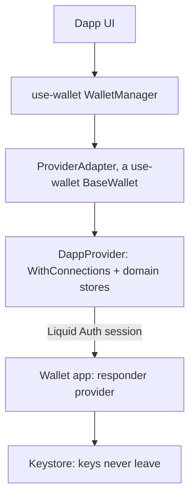

If you build Algorand dapps, you have probably met [use-wallet](https://github.com/TxnLab/use-wallet): the framework-agnostic library that gives a dapp one API over every wallet, with adapters for React, Vue, SolidJS, and Svelte. This page explains how the wallet provider stack and use-wallet relate, because they solve different halves of the same problem and meet in the middle.

## Two sides of one conversation

**use-wallet is the dapp side.** Its `WalletManager` holds a catalog of wallets (Pera, Defly, Lute, and so on), tracks which one is active and which account is selected, persists that choice, and exposes an ARC-0001 `signTransactions` plus an `algosdk`-compatible `transactionSigner`. A dapp developer writes against that surface once and every listed wallet just works.

**The wallet provider stack is the wallet side.** It is what you build an actual wallet out of: a keystore for the secrets, stores for accounts and identities, and a connections engine so dapps can reach it.

The two meet at a use-wallet **wallet adapter**. Every entry in the `WalletManager` catalog is a class implementing the same small contract: connect, disconnect, resume, sign. This repository ships a working adapter in `examples/use-wallet-client` that makes any provider-based wallet appear in a use-wallet dapp exactly like the established wallets do.

## The whole path

Reading top to bottom: the dapp calls use-wallet, use-wallet calls the adapter, the adapter drives a provider composed with `WithConnections`, and the connection carries requests to the real wallet, which signs with its keystore and returns only signatures.

The adapter maps the contract almost one to one:

- `connect()` calls `provider.connection.connect("liquid-auth", ...)`, renders the QR through a fallback callback, and, once the session connects, reads the wallet's shared accounts from `session.peer.domains.accounts`.
- `signTransactions(txnGroup, indexesToSign?)` flattens the group ARC-0001 style, marks which entries this wallet may sign (matching senders against the session's addresses), encodes them as base64 msgpack, and forwards them with `connection.signTransactions(sessionId, txns, walletIndexes)`.
- `resumeSession()` re-feeds the persisted peer records into the stores immediately and lets the transport re-establish in the background, so the dapp renders accounts before the wallet is even reachable.
- `disconnect()` tears down the session and revokes everything tagged with it.

## Why the fit is natural

Two design choices make the integration nearly frictionless:

**Shared state shape.** The accounts store partitions state by wallet key with one active wallet and one active account, which is the same model `WalletManager` uses. The example passes one TanStack store to both, so use-wallet's view of accounts and the provider's view are literally the same object. No syncing layer, no drift.

**Sessions carry the account list.** A use-wallet adapter must report accounts on connect and resume. Because the connections handshake already shares domain records and persists them with the session, the adapter just projects `session.peer.domains.accounts` into use-wallet's account shape.

## What this means for you

**Building a dapp?** Use use-wallet as usual, and register the adapter factory alongside the stock wallets. You get the provider-based wallet, plus everything the session shares that use-wallet has no vocabulary for: identities, credentials, secure messaging.

**Building a wallet?** You do not integrate with use-wallet directly. Make your wallet a connections responder (accept `liquid://` links, answer `signTransactions`, share your account records in the handshake) and every dapp running the adapter can reach you. The contract is spelled out in [Integrate with use-wallet](/guides/integrate-use-wallet/).

## Where to go next

- [Integrate with use-wallet](/guides/integrate-use-wallet/) for the code on both sides.
- [Connections](/concepts/connections/) for the session layer underneath.
- The runnable example at `examples/use-wallet-client` in the repository.
