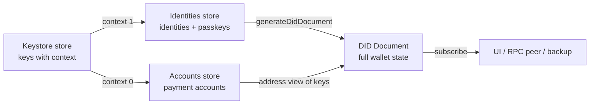

The Provider is the **optional composition layer** of this stack, not a requirement. Every domain package is a pure engine or store that runs entirely standalone: you can create a keystore, populate an accounts store, or open a connections engine with a plain function call and never construct a `WalletProvider` at all. When you want several domains sharing one context, the Provider composes those same engines through each package's `With*` extension, as both usage modes are equal citizens of the API.

This page explains how data moves through the Provider and its Wallet Provider Extensions, and why that shape lets us do something powerful: describe the entire state of a wallet (every identity, every account, every passkey) as a single, standard document that is always up to date, without any component telling any other component to update.

You do not need a React background. React is one consumer of these ideas, but the ideas themselves are plain TypeScript and work the same in a Node CLI, a background service, or a mobile app.

## Standalone or on a Provider

The same engine backs both modes. Standalone, the keystore is just a factory over a store you own:

```typescript
import { Store } from "@tanstack/store";
import { createWebKeyStore } from "@algorandfoundation/keystore-web";

const store = new Store({ keys: [], status: "idle" });
const keystore = createWebKeyStore({ store }); // no Provider anywhere
await keystore.ready;
```

With a Provider, the package's extension mounts that exact engine on the shared context:

```typescript
import { Provider } from "@algorandfoundation/wallet-provider";
import { WithKeyStore } from "@algorandfoundation/keystore-web";

const ProviderWithKeystore = Provider.withExtensions([WithKeyStore]);
const provider = new ProviderWithKeystore(
  { id: "my-wallet", name: "My Wallet" },
  { keystore: { store } },
);
```

Nothing about the flow model below changes between the two. The stores, the subscriptions, and the rules are identical; the Provider only saves you the wiring when multiple domains live together.

## The superpower: your whole wallet as one document

A wallet is really a small pile of **keys**. Some of those keys are the user's **identity**, some are **payment accounts**, some are **passkeys**. Historically each of those lived in its own silo with its own format, and nothing could describe the whole picture at once.

Because this system keeps all of that state in coordinated stores, it can project the complete state of the wallet into a single **W3C DID Document** at any instant. That document answers, in one standard artifact:

- _Who is this?_ The identity's `did:key`.
- _What keys prove it?_ Every verification method (Ed25519 identity and account keys, P-256 passkeys).
- _What can it connect to?_ Services, such as WebRTC ICE servers.

Crucially, the document is derived from the stores rather than hand-written, so it is never stale. Add a passkey or derive a new account and the document updates itself. It is a backup format, a sync format, and a portable description of the wallet's capabilities, all at once.

## The problem the flow model solves

The naive way to wire a keystore, an accounts layer, an identities layer, and a UI is direct calls: when a key is added, the keystore calls `accounts.add(...)`, which calls `identities.add(...)`, which calls `ui.refresh()`. That rots fast:

- **Everything knows about everything.** Every producer of a change must be taught about every new consumer.
- **Order-of-operations bugs.** A consumer that reads halfway through an update sees a torn state: a key added but its account not yet built.
- **No single truth.** Keys, accounts, identities, and a cached UI copy drift apart.

The state-flow architecture makes those problems structurally impossible with three rules.

## The three rules

### Rule 1: one store per domain

A store holds one well-defined slice of state and lets you read it, replace it, and subscribe to changes. If two parts of the app disagree, the store is right and they are wrong, by construction, because they both read from it. Each store also draws a clean package boundary: the accounts package never imports the identities package. The store is the contract between them.

### Rule 2: replace, don't edit

State is only ever replaced, never mutated in place:

```typescript
// What we do NOT do: editing the existing array in place.
store.state.accounts.push(newAccount);

// What we DO: build a brand-new state object from the old one.
store.setState((state) => ({
  ...state,
  accounts: [account, ...state.accounts],
}));
```

Why it earns its keep:

1. **Cheap change detection.** "Did anything change?" is a reference check, `oldState !== newState`, not a deep comparison. Mutate in place and the reference never changes, so views silently go stale. This is the single most common bug the rule removes.
2. **No torn reads.** A subscriber always sees a complete snapshot; the swap from old to new is atomic.
3. **Debugging and backups for free.** Old snapshots are never mutated, so you can log, diff, and keep them.

The mental model: state is a series of photographs, not a whiteboard. You never erase and rewrite; you pin up a new photo each time and everyone looks at the latest one.

### Rule 3: subscribe, don't call

Consumers subscribe to stores; producers never call consumers directly:

```typescript
accountsStore.subscribe((state) => {
  /* react to new accounts */
});
```

That is the whole trick behind the DID document: it subscribes to the stores and rebuilds itself. Nobody has to remember to call it.

## Routing keys by role

The wallet always knows what every key is for, because keys are derived under a numeric `context` and small **bridge extensions** route them accordingly:

- **Context 0 becomes a payment account.** The accounts bridge (`accounts/keystore-extension`, a reference example; the production implementation is the `algorand-accounts-extension`) turns each address-context key into a spendable account.
- **Context 1 becomes an identity.** The identities bridge (`identities/keystore-extension`) turns each identity-context key into an `Identity` with a `did:key` and a DID document.

Both bridges hydrate once from the keystore's current snapshot, then subscribe and reconcile on every change, guarding on `status` so they only act on settled snapshots.

An account created this way is a **view of a key, not a copy**. It stores only a reference (`keyId`) and a `sign` method that delegates back to the keystore. Truth stays where it belongs.

## The full picture



Every arrow is a subscription, not a direct call. The keystore does not know the bridges exist; the bridges do not know the DID projection or the UI exists. Each layer only replaces its own state and trusts the flow.

Because the identities bridge subscribes to the keystore, whenever any key in a seed's hierarchy changes it re-renders every affected identity's document. The document is therefore a live mirror of the wallet's full state, which is why it doubles as a backup: the same bridge can `restoreFromDidDocument`, re-deriving the exact keys the document describes.

## One model, three deployment shapes

Real deployments are rarely one process. The same account lives on a phone, is brokered by a service, and is used by a web page. The flow model serves all three, because each perspective is just a different source of truth feeding the same stores:

- **Wallet**: a client that can actually sign. Its keystore is the real source of truth; everything else is a view of it.
- **RPC**: a service standing between a wallet and its consumer (a custody provider, or another wallet reached over LiquidAuth). It usually has no local keystore; it has accounts connected to a wallet and forwards signing requests.
- **Web**: a client that requests access to a wallet through an RPC connection. It may own a small keystore of its own, not for the user's real accounts but for session keys that authenticate and encrypt the channel.

None of these needs a different architecture. A remote account is still just an account: same store, same shape, with `sign` pointed at the wire instead of the local keystore.

## Practical rules of thumb

- Never mutate `store.state` directly. Always `setState` with a fresh object.
- Read through the store, not a cached copy. If you keep a second list "in sync", delete it and subscribe instead.
- Producers don't call consumers. If module A needs module B to react, A updates a store and B subscribes.
- Route keys by role. A key's `context` decides whether it is a payment account or an identity; keep that the single place the decision is made.
- Guard on `status` before acting on a snapshot when a store has a lifecycle.
- Keep private material out of state. Stores hold metadata and references; the keystore performs the sensitive operation on request.
- Keep chain specifics in chain packages. Generic stores must not import a chain SDK; address and mnemonic logic belongs behind a chain-specific bridge or shim.

Follow these and the full-state DID document is not something you have to carefully maintain. The architecture hands it to you for free, correct by construction.
